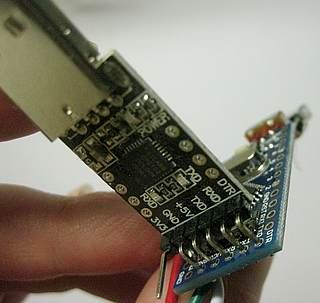

# LEDController2812IR


~~Simple~~ Flexible controller for ws2812b ws2811 stripes with support of IR control, keypad shield LCD, 3 or 5-buttons, settings over USB.
 Includes a lot of effects.

### Сoncept
There are save/load slots, many effects, each rich of settings.

You can build it with hardware options:
```C
//#define keypad1602 //free D0..3, D11..13, A1..
#define IRkeypad	//3*7, ask me about support other types
//#define key5x
//#define key3x		//central btn switch mode (settings). Side btns are +-, i.e. effN, speed, length, gamma
//#define SerialControl //USB protocol for external GUI //! TODO software for PC, android
//#define SerialSelect //enter effect № in terminal
//#define LCD2004_i2c						//A4 A5
```

*With IRkeypad:
At power up Switch between "settings"  (IR) and "working" (faster) modes.
Choose effect, each has many settings to customize. It saves last.
It save/load presets by press numbers buttons in  "settings mode" / "working mode".

*With keypad1602 or key3x: you have to press select button to select option (effect, speed, length, chennels), than change it with +- keys
*With key5x: all main options has button.
*With USBcontrol: create presets in PC software, fast load it with buttons

TODO
Presets are the first 10 effect slots:
* slot 0 - auto-saved last used effect and settings
* slots 1..9 you can manually save/load to EEPROM
* slots 10...254  constant links to effect and settings set for it
* slot 252 endless different effect switch (so if your customer ask about over 9000 effects - you can use this :)
* slot 253 predefined show sequence
* slot 254 random demo
* slot 255 random demo fast

### Hardware and reference design:

pro mini or other

VS1838 (pins: D6, GND, VCC)

switch (pins: A4, GND)

LED stripe of WS2812  (pins: D2, GND)

3x7 IR keypad


### Characteristics

power on 5v (VCC) can be as low as 3.3v LED also working.

atmega168 for 60-150 LEDs

atmega328 for 90-300 LEDs

atmega2560 for 1000-2000 LEDs

IRkeypad eat a lot of memory

### basic instructions
0. Assemble the device
1. Install USB-COM programmer driver e.g. CP2102
2. use lightweight portable HEX uploader http://xloader.russemotto.com or compile from source

3. Choose hex, port, type of controller 168/328/.. Upload
4. Connect to stripe.
### Cautions
* Don't power stripe (e.g. longer than 15px with White light LEDs) through USB-programmer-controller boards. Disconnect "+" wire beetween stripe and controller or use separate power while connectiong USB
* Check + - and max 5v .
* Bad PSU can adds 1v noise to 5v output, so if you have to use cheap one - add diode (with enought power rating 1A-2-5-10A) to + wire so it down voltage a bit or use down DC-DC.
* Connect power AFTER all assembled with good GND wire connection
* Don't see on bright Blue LEDs (or white because it is from Blue) while testing if you need your eyes for a long life. Use diffuser, dim power, itc.
### Hints
* to maintain max quality (bit depth) regulate brightness not by program but via DC-DC down modules like XL4005 (without current limit)

